# Solidity_Smart_Contract
Ethereum, Solidity, Ethereum Virtual Machine(EVM), Remix, Blockchain-Technology

## Overview:

This is an application that is based on Solidity smart contract to automate the financial process and features of joint saving accounts.This smart contract accepts two user addresses that controls a joint savings account by using ether management function to implement financial institutions requirements for providing the  ability to deposit and withdraw the funds from the account.

## Technologies
This project runs on Solidity and Remix IDE.

### Open the Remix IDE

To use this application first open the Remix IDE (https://remix.ethereum.org/#optimize=false&runs=200&evmVersion=null&version=soljson-v0.8.7+commit.e28d00a7.js).In the Featured Plugins area,click the Solidity button, as the following image shows:

Now execute the following steps:
* In the IDE click the "File explorers" button.
* In the File Explorers pane, on the toolbar,click the Create New File button and create a file named joint_saving.sol.
*  Next, clone the repo and copy the code from joint_savings.sol file.Navigate to the “Deploy & run transactions” pane and select Remix VM(London) execution environment.
* Now click the Deploy button to deploy the smart contract, and then confirm that it successfully deployed.

### Interact with Your Deployed Smart Contract

To interact with your deployed smart contract, complete the following steps:

1. Use the setAccounts function to define the authorized Ethereum address that will be able to withdraw funds from your contract.

You can create new, dummy addresses on the Vanity-ETH (https://vanity-eth.tk) website, which includes an Ethereum vanity address generator.

2. Test the deposit functionality of your smart contract by sending the some amounts of ether. After each transaction, use the contractBalance function to verify that the funds were added to your contract.

3. Once you’ve successfully deposited funds into your contract, test the contract’s withdrawal functionality by withdrawing some ether into accountOne and accountTwo. After each transaction, use the contractBalance function to verify that the funds were withdrawn from your contract. Also, use the lastToWithdraw and lastWithdrawAmount functions to verify that the address and amount were correct.

### Execution Results:

### Deployed Contract

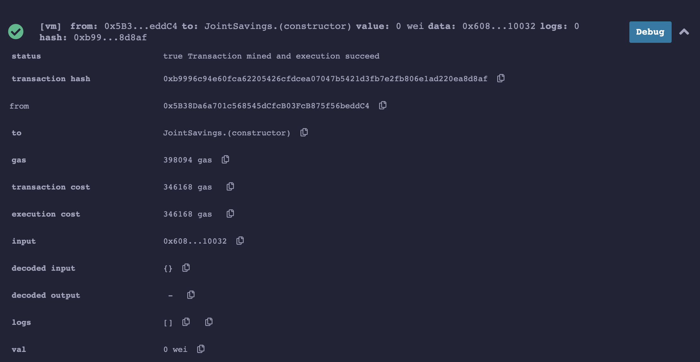

### Authorized Ethereum Address

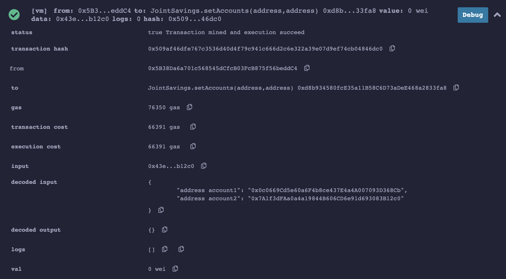

### Transaction 1: Depositing 1 ether 

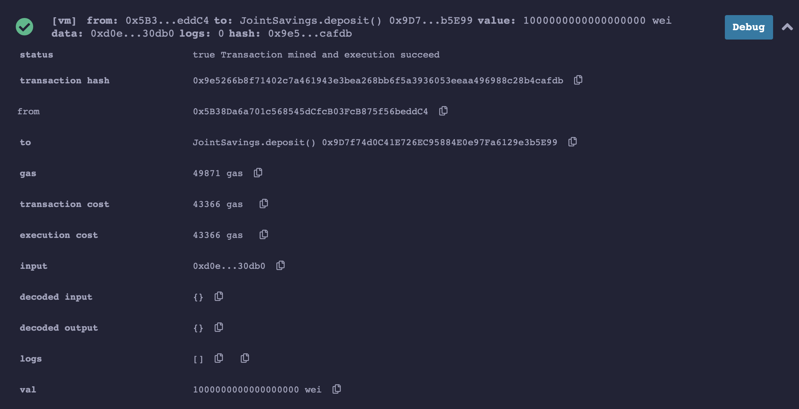

### Contract Balance after depositing 1 ether

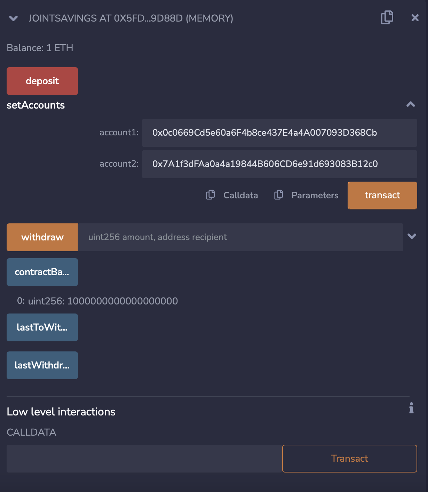

### Transaction 2: Depositing 10 ether 

### Contract Balance after depositing 10 ether

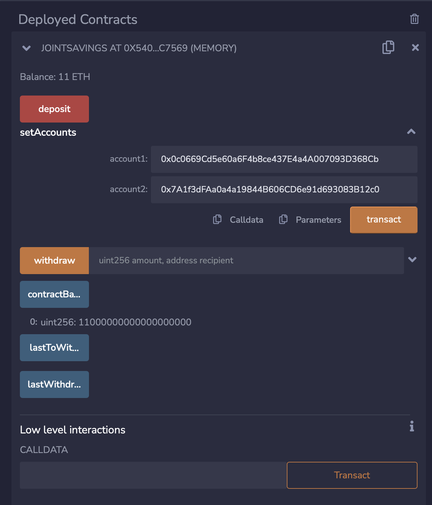

### Transaction 3: Depositing 5 ether

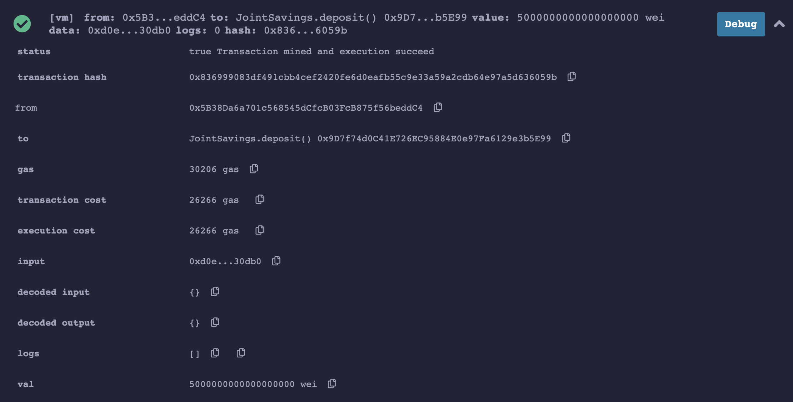

### Contract Balance after depositing 5 ether

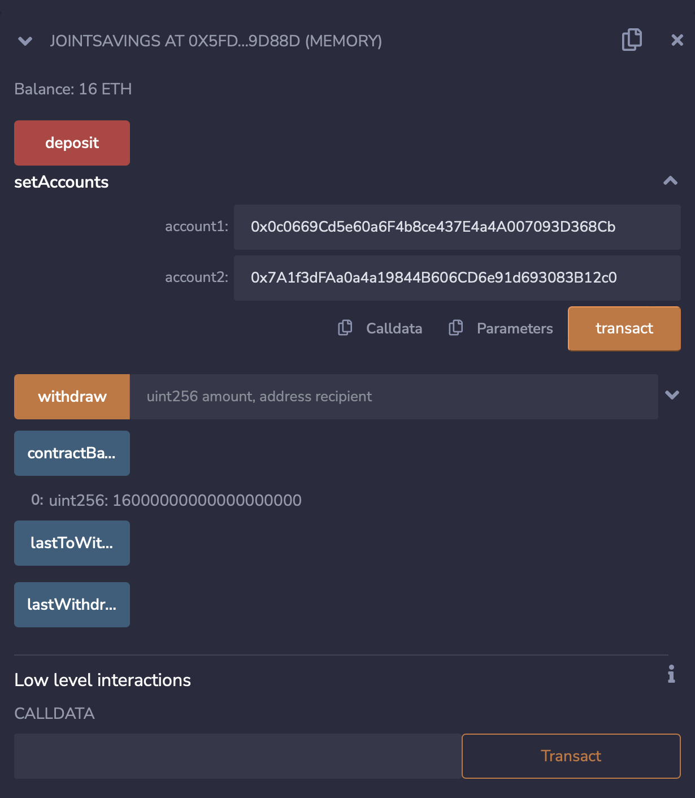

### Withdrawing 5 ether into Account 1
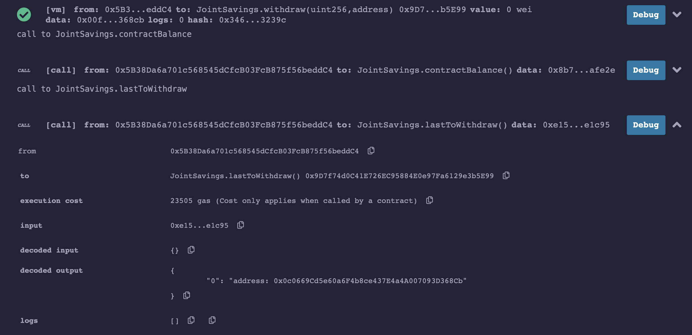

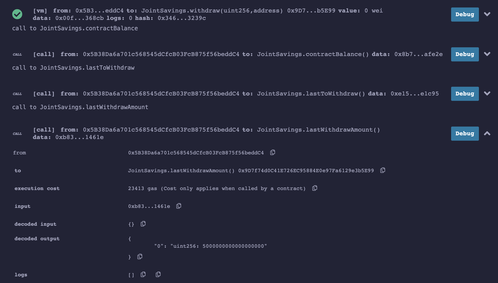

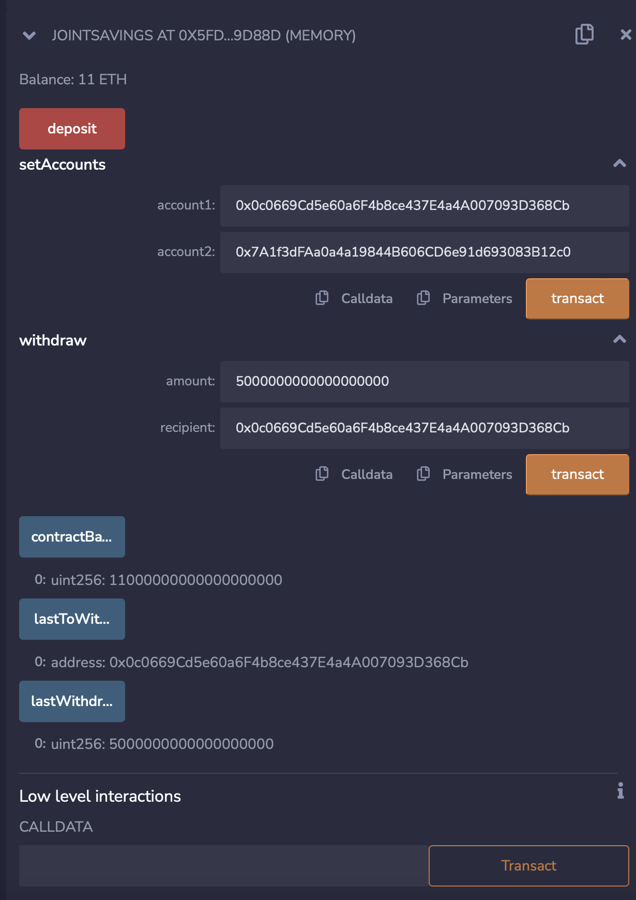

### Withdrawing 10 ether into Account 2

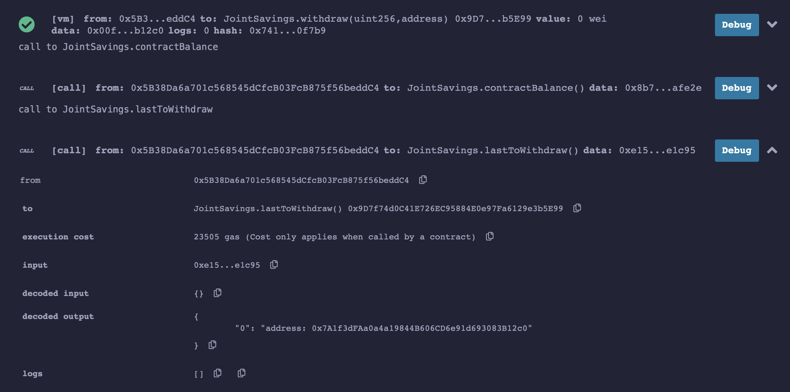

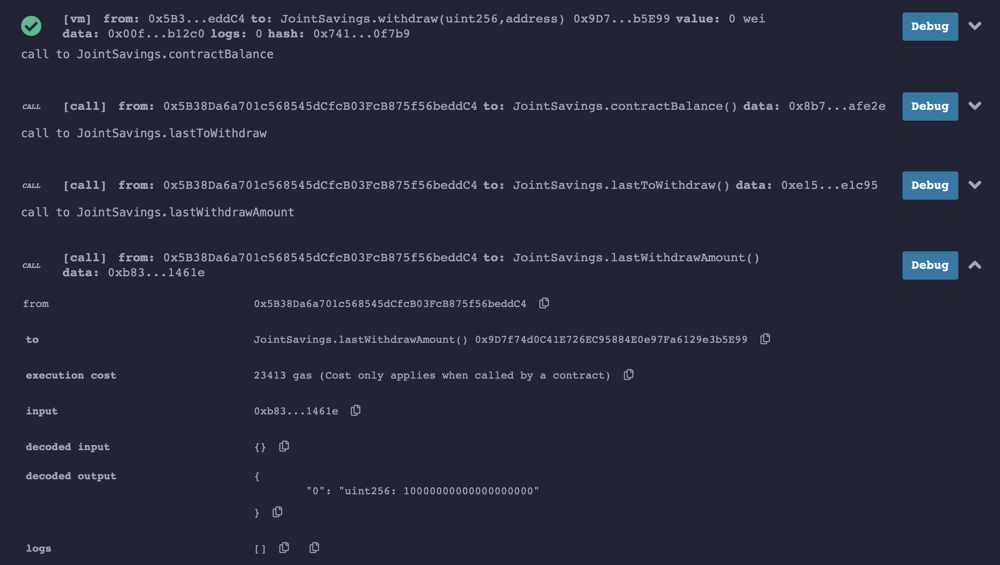

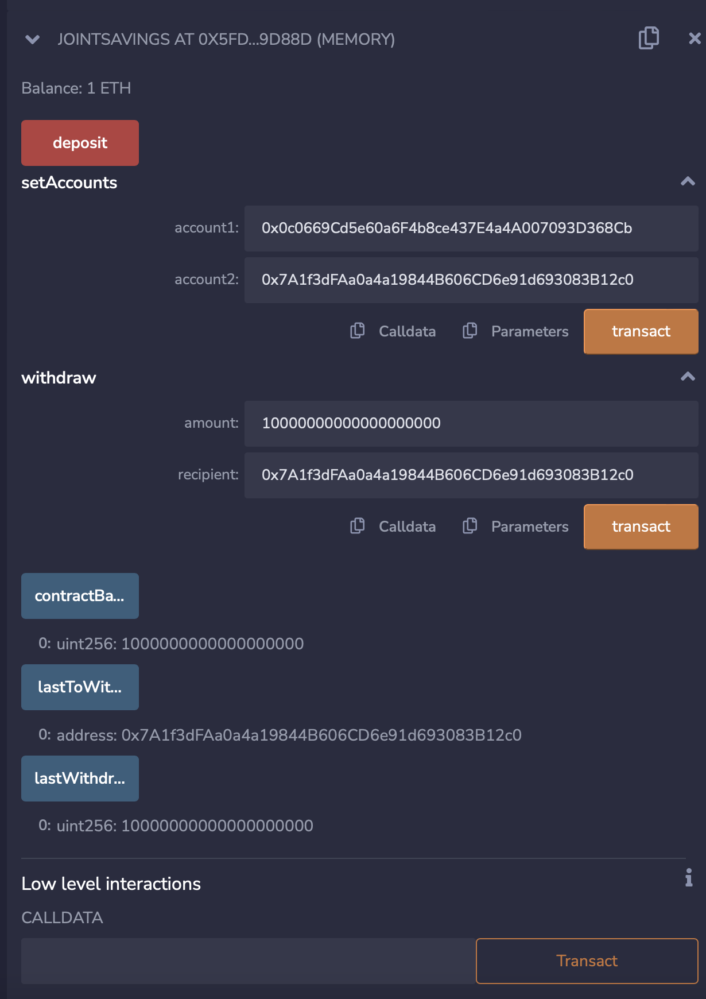

## Contributers

Manisha Lal

11/02/2022

manisha.lal.2009@gmail.com
___

## License
copyright 2022
